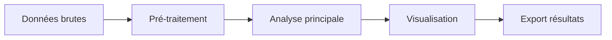

# 💻 Analyse bioinformatique

> **Date :** YYYY-MM-DD  
> **Projet :** [Biologie / Biomécanique / Données Humaines]  
> **Sous-partie :** [Analyse Light Sheet | RNA-seq | Mesures morpho | Statistiques croissance | ...]  
> **Analyste :** [Ton nom]  
> **Statut :** 🟡 En cours | 🟢 Terminé | 🔴 Bloqué | 🔁 À relancer

---

## Objectif de l'analyse

_Question biologique à laquelle cette analyse répond._

## Données d'entrée

| Paramètre | Détail |
|---|---|
| Source des données | [Expérience du JJ/MM, base de données, ...] |
| Format | [FASTQ, TIFF, CSV, DICOM, ...] |
| Volume | [N fichiers, taille totale] |
| Localisation | [chemin serveur / disque] |
| Pré-traitement | [Déjà fait ? Lequel ?] |

## Environnement technique

```
# Système
OS : 
RAM : 
GPU : 

# Logiciels / versions
Python :        | R : 
Packages clés : 
Autres outils : [ImageJ/Fiji, 3D Slicer, ...]

# Reproductibilité
Environnement : [conda env / docker / ...]
Config file :   [chemin]
Random seed :   
```

## Pipeline d'analyse



### Étapes détaillées

**1. Pré-traitement**
- Input : 
- Opérations : 
- Output : 
- Commande / script : `script_name.py --param value`

**2. Analyse principale**
- Méthode : 
- Paramètres clés : 
- Output : 
- Commande : ``

**3. Post-traitement / visualisation**
- Type de visualisation : 
- Output : 

## Résultats

### Métriques clés

| Métrique | Valeur | Attendu | Commentaire |
|---|---|---|---|
| | | | |
| | | | |

### Figures générées

- `figures/YYYY-MM-DD_fig1_description.png` — 
- `figures/YYYY-MM-DD_fig2_description.png` — 

### Résultats statistiques

| Test | Groupes | Statistique | p-value | Significatif |
|---|---|---|---|---|
| | | | | |

## Interprétation

_Que révèlent ces résultats ? Cohérence avec les résultats wet lab ?_

## Problèmes et solutions

| Problème | Cause probable | Solution appliquée |
|---|---|---|
| | | |

## Scripts et reproductibilité

| Script | Description | Localisation |
|---|---|---|
| | | |
| | | |

## Prochaines étapes

- [ ] Action 1 — Deadline : 
- [ ] Action 2 — Deadline : 

## Liens

- Expérience source : [lien entrée wet lab]
- Données brutes : [chemin]
- Repo / notebook : [lien]

---
*Dernière modification : YYYY-MM-DD*
